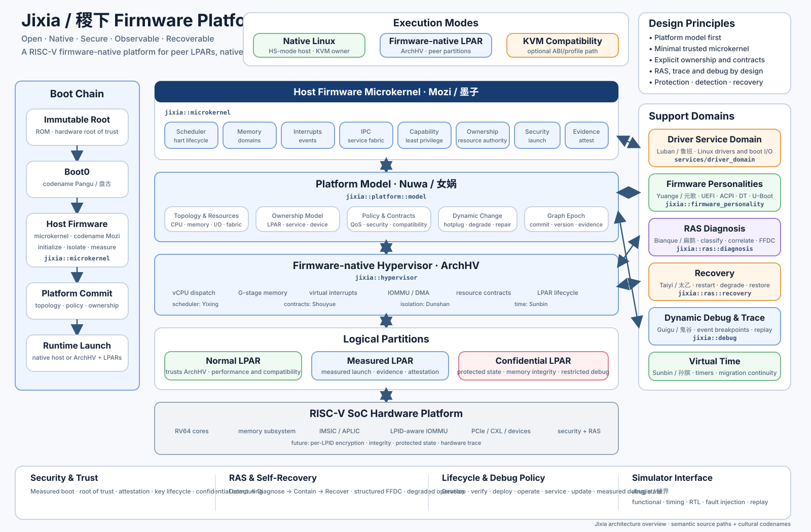

# 稷下 Jixia

**A RISC-V firmware-native logical partition, RAS, security, and full-system co-design project.**

> 稷下容百家，墨子立其规；女娲构其形，鲁班驭百器。

<p align="center">
  <a href="docs/images/jixia-firmware-architecture.svg">
    
  </a>
</p>

<p align="center"><em>Jixia firmware platform overview — click the diagram to open the full-size vector image.</em></p>

Jixia is a learning-driven server platform project. It studies what a machine looks like when firmware, logical partitions, RAS, trusted/confidential computing, and a full-system simulator are designed together from the first instruction.

It is not an attempt to clone IBM PowerVM, EDK II, or KVM. Native Linux/KVM remains a supported execution profile and mainstream comparison baseline.

## Naming policy

**Jixia / 稷下** is the public project and platform name.

Chinese cultural names are implementation codenames used in architecture diagrams, releases, presentations, and module descriptions. Source directories, public interfaces, types, functions, and C++ namespaces use clear English technical meaning.

Examples:

```text
Mozi / 墨子      -> host firmware microkernel -> microkernel/ -> jixia::microkernel
Pangu / 盘古     -> immutable Boot0           -> boot/        -> jixia::boot
Nuwa / 女娲      -> PlatformGraph              -> platform/model/
Luban / 鲁班     -> Linux driver domain       -> services/driver_domain/
Yuange / 元歌    -> firmware personalities    -> firmware_personality/
Bianque / 扁鹊   -> RAS diagnosis             -> ras/diagnosis/
Taiyi / 太乙     -> recovery                  -> ras/recovery/
Guigu / 鬼谷     -> dynamic debug             -> debug/
Jingjie / 镜界   -> full-system simulator     -> interfaces/simulator/
```

Low-level assembly and cross-language boundaries use a small stable C ABI with `jixia_` symbols. C++ implementation code uses nested namespaces such as:

```cpp
namespace jixia::microkernel {}
namespace jixia::platform::graph {}
namespace jixia::hypervisor::scheduler {}
namespace jixia::ras::diagnosis {}
namespace jixia::debug::replay {}
```

## Architecture codenames

| Codename | Technical responsibility |
|---|---|
| **Jixia / 稷下** | Entire firmware-native platform |
| **Pangu / 盘古** | Immutable Boot0 / first-instruction root |
| **Mozi / 墨子** | Host firmware microkernel |
| **Nuwa / 女娲** | PlatformGraph and topology construction/repair |
| **ArchHV** | Firmware-native type-1 hypervisor |
| **Yixing / 弈星** | LPAR scheduling and placement |
| **Shouyue / 守约** | Entitlement and resource contracts |
| **Dunshan / 盾山** | Isolation, IOMMU, DMA, and ownership protection |
| **Luban / 鲁班** | Linux driver and boot service domain |
| **Yuange / 元歌** | UEFI/ACPI, SBI/DT, and U-Boot/FIT personalities |
| **Bianque / 扁鹊** | RAS diagnosis and FFDC correlation |
| **Taiyi / 太乙** | Recovery and degraded-mode actions |
| **Sunbin / 孙膑** | Virtual time and migration continuity |
| **Guigu / 鬼谷** | Dynamic debug, introspection, injection, and replay |
| **Jingjie / 镜界** | Full-system simulator and co-simulation world |

## Execution profiles

```text
NATIVE_HOST
  Boot0/microkernel -> native HS-mode Linux -> KVM guests

SINGLE_LPAR
  Boot0/microkernel -> ArchHV -> one VS-mode logical partition

MULTI_LPAR
  Boot0/microkernel -> ArchHV -> multiple peer logical partitions
```

A single LPAR is not automatically a normal KVM host. Native Linux must own HS-mode and the RISC-V H extension to run ordinary KVM guests; a Linux LPAR under ArchHV normally runs in VS-mode.

## Current state

Integrated stable foundation:

- `M00-00`: RV64 QEMU virt entry, hart filtering, `gp`, stack, BSS, UART.
- `M00-01`: minimal fatal M-mode trap path.
- `M00-02`: complete RV64 TrapFrame and save/restore ABI.
- `M00-03`: recoverable 32-bit `EBREAK` and 16-bit `C.EBREAK` through `mret`.
- `M00-04`: recoverable machine timer interrupt.
- `F00-01`: shared freestanding formatter, KernelLogBuffer, and `printk` with temporary raw-UART mirror.
- `M00-05`: private per-hart stacks, dense HartIndex, `HartLocal`, `mscratch` binding, boot-hart rendezvous, bounded FDT CPU population discovery, per-hart timer state/compare, and SMP acceptance for 1/2/4 harts with controlled over-capacity rejection.

Current development:

```text
ACTIVE  M00-06 Privilege transition foundation
NEXT    M00-07 Early physical allocator
NEXT    M00-08 Structured event and trace ABI
NEXT    M00-09 Automated QEMU test harness
```

M00-06 begins with a controlled `M -> S -> M` transition while keeping `satp = 0` so privilege mechanics are separated from paging. The key new invariant is that M-mode trap entry must not trust a lower-privilege `sp`; the existing `mscratch -> HartLocal` anchor is the starting point for trusted per-hart trap-stack entry.

M00-05 design record:

- [`docs/JIXIA_M00_05_SMP_FOUNDATION.md`](docs/JIXIA_M00_05_SMP_FOUNDATION.md)

## Console and observability

The minimum kernel diagnostic path is intentionally small:

```text
printk -> shared formatter -> KernelLogBuffer -> optional raw-UART mirror
```

The richer runtime Console Service is deferred until tasks, IPC, service lifecycle, allocator/runtime, and device ownership exist. Structured Trace and RAS events remain separate contracts from console text.

Design records:

- [`docs/JIXIA_CONSOLE_DESIGN.md`](docs/JIXIA_CONSOLE_DESIGN.md)
- [`docs/JIXIA_CONCURRENCY_CORRECTNESS_RULES.md`](docs/JIXIA_CONCURRENCY_CORRECTNESS_RULES.md)
- [`docs/JIXIA_TRACE_OBSERVABILITY_VISION.md`](docs/JIXIA_TRACE_OBSERVABILITY_VISION.md)

## RAS direction

Jixia studies an AI-era extension of Power-style deterministic RAS diagnostics:

```text
Structured Event
    + PlatformGraph
    + deterministic PRD-style rules
    + Machine Health Journal / Case Memory
    + optional AI reasoning / candidate-rule mining
    + HWP active probes
    + Jingjie replay/validation
    -> deterministic, auditable recovery policy
```

AI may propose hypotheses and candidate rules; accepted recovery actions remain deterministic and policy-controlled.

See:

- [`docs/JIXIA_RAS_ARCHITECTURE.md`](docs/JIXIA_RAS_ARCHITECTURE.md)
- [`docs/JIXIA_RAS_REASONING_VISION.md`](docs/JIXIA_RAS_REASONING_VISION.md)
- [`docs/JIXIA_AI_RAS_ARCHITECTURE_SUMMARY.md`](docs/JIXIA_AI_RAS_ARCHITECTURE_SUMMARY.md)

## Quick start

For Debian/Ubuntu/Deepin/UOS development hosts:

```bash
git clone <repository-url>
cd Firmware

bash scripts/setup-dev-env.sh
bash scripts/jixia.sh run
```

Check an existing host without modifying it:

```bash
bash scripts/setup-dev-env.sh --check
```

Build only:

```bash
bash scripts/jixia.sh build
```

Run with a chosen hart population:

```bash
bash scripts/jixia.sh run --smp 1
bash scripts/jixia.sh run --smp 2
bash scripts/jixia.sh run --smp 4
```

Debug through QEMU GDB server:

```bash
bash scripts/jixia.sh debug --smp 4
```

Stop at a symbol:

```bash
bash scripts/jixia.sh debug \
    --break jixia_microkernel_boot_main
```

Generic QEMU runs record reproducibility evidence under:

```text
build/clion-debug/logs/<mode>-<timestamp>/
    serial.log
    qemu.log
    command.txt
```

Detailed workflow:

- [`docs/JIXIA_DEVELOPER_WORKFLOW.md`](docs/JIXIA_DEVELOPER_WORKFLOW.md)

The CMake preset remains available:

```bash
cmake --preset jixia-rv64-debug
cmake --build --preset jixia-rv64-debug
```

Generated artifacts include:

```text
build/clion-debug/jixia.elf
build/clion-debug/jixia.bin
build/clion-debug/jixia.map
build/clion-debug/jixia.dis
build/clion-debug/jixia.readelf
```

Milestone-specific acceptance scripts remain authoritative for pass/fail; a successful interactive `jixia.sh run` does not replace them.

## Repository layout

```text
boot/                    Boot0 contract (codename Pangu)
microkernel/             executable host firmware microkernel (Mozi)
  arch/riscv/            trap/ISA architecture code
  console/               minimum Kernel Print path
  core/                  kernel mechanisms/policy/tests
lib/                     freestanding shared utilities
platform/model/          PlatformGraph and ownership model (Nuwa)
hypervisor/              firmware-native partition runtime (ArchHV)
services/driver_domain/  Linux driver and boot service (Luban)
firmware_personality/    OS-facing personalities (Yuange)
ras/diagnosis/           RAS diagnosis (Bianque)
ras/recovery/            recovery actions (Taiyi)
debug/                   dynamic debug and introspection (Guigu)
virtualization/time/     virtual time and migration (Sunbin)
security/confidential/   confidential LPAR architecture
interfaces/simulator/    firmware-simulator boundary (Jingjie)

platform/qemu_virt/      current physical-platform backend
linker/                  linker scripts
scripts/                 environment/build/run/debug/test helpers
docs/                    architecture, design, source, and progress records
```

Placeholder module directories define ownership and planned interfaces; they do not claim completed implementations.

## Read first

Every new project conversation or coding session begins with:

1. [`PROJECT_CONTEXT.md`](PROJECT_CONTEXT.md)
2. [`docs/JIXIA_PROGRESS.md`](docs/JIXIA_PROGRESS.md)
3. [`docs/JIXIA_SOLO_ROADMAP.md`](docs/JIXIA_SOLO_ROADMAP.md)
4. [`docs/JIXIA_ARCHITECTURE_V0.3.md`](docs/JIXIA_ARCHITECTURE_V0.3.md)
5. relevant milestone/design records
6. current code, current progress branch, and recent commits

Repository state wins over remembered chat state unless the repository is explicitly known to be stale.
